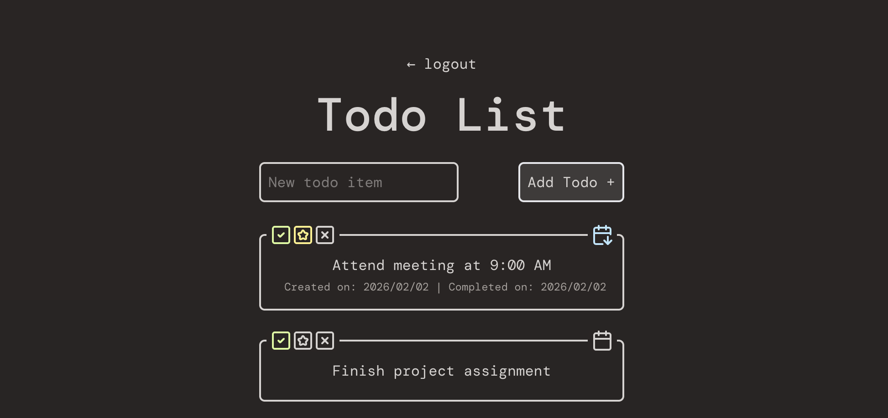

# Todo List
Minimalistic task tracker for activities and events with completion and starring functionality.



## Tech Stack
- React
- TypeScript
- Vite
- Tailwind CSS
- Java
- SpringBoot

## Project Structure
```
demoapp/
├── backend/ # (Spring Boot)
└── frontend/ # (React + TypeScript)
```

## Installation
Clone the repository and start the backend:
```bash
git clone https://github.com/mynavu/todo_list2.git
cd ./spring-react/backend
./mvnw spring-boot:run
```
In a separate terminal, start the frontend:
```bash
cd ./spring-react/frontend
npm install
npm run dev
```

## Usage
Open the app at: http://localhost:5173
